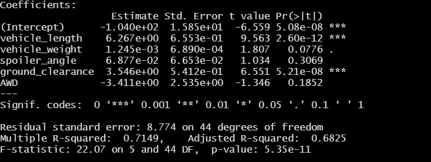
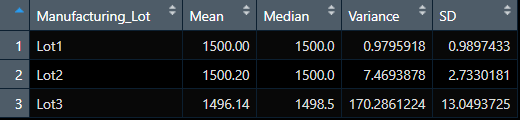
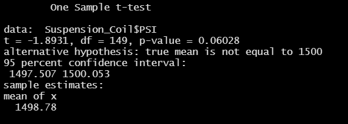
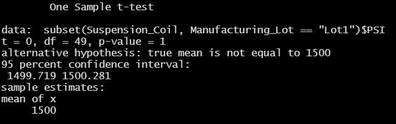
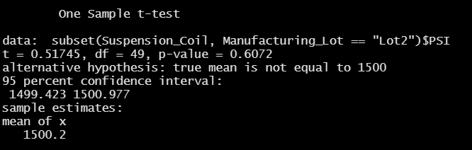
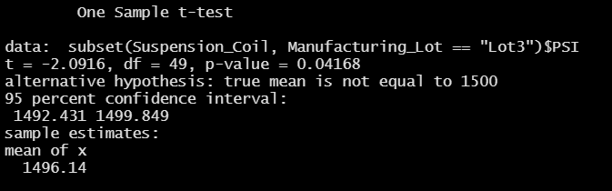

# MechaCar_Statistical_Analysis
In this project we have used R as our programming language that helps to make data manipulation, statistical analysis and visualization easier. We have used different functions in R
to read our dataset,manipulate data and perform statistical calculations. AutoRUs is a car manufacturing company whose newest prototype is the MechaCar. We have to perform a data
analysis with statistical tests which will provide summary statistics for different variables. It can help improve the manufacturing of the MechaCar and will also give an insight
about the factors that can affect the car production.its performance and sale .

## Linear Regression to Predict MPG

In this statistical test we performed a multiple linear regression with "mpg" as our dependent variable and vehicle length, vehicle weight, spoiler angle, drivetrain, and ground clearance
as our independent variables to determine if there is a significant relationship between dependent and the independent variables. Using R , we performed our linear regression to
design a linear model that predicts the mpg of MechaCar prototypes using several variables. Below is the snapshot of our results:

 

1. Which variables/coefficients provided a non-random amount of variance to the mpg values in the dataset?

   The vehicle_length and ground_clearance variables provide a non-random amount of variance to the mpg values in the dataset. As we can see the Pr(>|t|) value of these variables
   is very small which means that the vehicle length and ground clearance are statistically unlikely to provide random amounts of variance to the linear model.
   The vehicle length and ground clearance have a significant impact on mpg of the vehicle.
   
2. Is the slope of the linear model considered to be zero? 
	
   As we can see from the results p-value is 5.35e-11 which is quite less than significance level of 0.05. This means that we have sufficient evidence to reject our null hypothesis and the slope of
   the linear model is not zero. There is some significant relationship between mpg and some of the independent variables like vehicle_length and ground_clearance.
	
3. Does this linear model predict mpg of MechaCar prototypes effectively?
	
   The  r-squared value that is the coefficient of determination for this model is 0.71 which is quite good and indicates that our linear regression model can effectively predict mpg 
   of MechaCar prototypes.The future data points will fit our linear model and can be used to predict the mpg of the car.  

## Summary Statistics on Suspension Coils

In this statistical analysis we have created a summary data for the weight capacities of multiple suspension coils to determine if the manufacturing process is consistent across production lots.
The PSI value summary is also calculated across each production lot.
	

	
1. As we can see from the snapshot above the variance of the entire dataset for suspension coils of all the production lot is 62.29 (PSI). The design specifications for the MechaCar
   suspension coils dictate that the variance of the suspension coils must not exceed 100 pounds per square inch(PSI). So the current manufacturing data meet this design specification 
   for all manufacturing lots in total.
   
2. 
	
	As we can see from the snapshot above the variance of lot1 and lot2 is much less than 100 but the variance of lot3 is quite higher than 100 that is 170.28
	This is because most of the PSI values for lot3 deviate from its mean or average value . So the current manufacturing data does not meet the design specification
	for manufacturing lot3.
	But for lot1 and lot2 the current manufacturing data meets the design specifications for the suspension coils.
	

## T-Tests on Suspension Coils

In this statistical test we have performed t-test to determine if all manufacturing lots and each lot individually are statistically different from the population mean of
1,500 pounds per square inch.

1. 

	The p-value from the t-test for all the manufacturing lots is 0.06 which is greater than significance level 0.05 . This means that we do not have enough evidence to reject
	our null hypothesis and we can say there is no statistical difference in mean of all the manufacturing lots PSI and the population mean.
	
2. 

	The p-value from the t-test for the manufacturing lot1 is 1 which means that the mean of all the manufacturing lot1 PSI is exactly same as the population mean of
	1,500 pounds per square inch. So our null hypothesis is true and there is no statistical difference in the two.
	
3. 

	The p-value from the t-test for the manufacturing lot2 is 0.6 which is much greater than significance level 0.05 . This means that we do not have enough evidence to reject
	our null hypothesis and we can say there is no statistical difference in mean of the manufacturing lot2 PSI and the population mean. 
	
4. 

	The p-value from the t-test for the manufacturing lot3 is 0.04 which is less than significance level 0.05 . This means we have evidence to reject our null hypothesis and
	we can say that there is a statistical difference in mean of the manufacturing lot3 PSI and the population mean. 
	
	
## Study Design: MechaCar vs Competition

1. The cost of the car is one of the most important starting point a customer considers when buying a car. The cost of a car depends on various factors like fuel efficiency,
   horsepower,safety rating,year of manufacturing ,features provided and so on. For our test we will consider the numerical variables on which the cost of the car which is a 
   dependent variable will depend.
   Metrics used will be the cost of the car and its mpg and horsepower.
   
2. Null hypothesis will be that the cost of the car does not depend on the mpg and the horsepower. Alternate hypothesis will be that the cost of the car will depend on the mpg 
   and horsepower and that these variables will have a significant impact on the cost of the car.
   
3. The statistical test used will be the Multiple linear regression test because it uses multiple independent variables to account for parts of the total variance observed in the
   dependent variable. Here we have more than one independent variable that we are using in our testing that is mpg and horsepower. Also we want to create a model that in future can
   predict the cost of car with various data points. So with current data points we will train and test our model to do so.

4. The data required for this test would be a dataset with the cost of the car,its mpg and horsepower along with other variables that are important in determination of the cost of 
   the car like features, safety, technical features etc. The data should have a linear pattern and also there should be multiple observations for the independent variable that is
   mpg, horsepower,features,safety etc  and they must be different values. 
   Also we need to collect data from other car manufacturers with the same variables to compare the cost of the car and then make further analysis on the performance
   of MechaCar compared to other cars. 